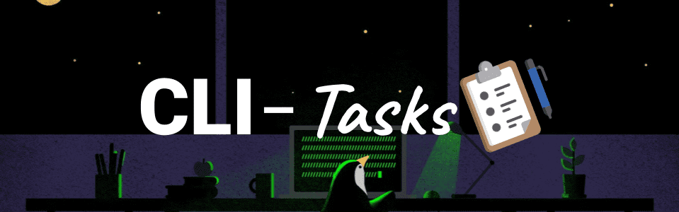

# CLI-TASKS APPLICATION  [](https://github.com/joehann-9s/api-gtd/releases/tag/v1.0) [](https://golang.org/doc/go1.20) 



A basic TODO-LIST CLI application using Golang.


# Getting Started
## Installation
1. Clone this repository to your local machine.
    ```bash
    git clone https://github.com/joehann-9s/cli-tasks.git
    ```

2. Run the following command to install the dependencies:
    ```bash
    cd cli-tasks
    go version
    go mod download
    ```

3. Start the server using the following command:
    - Development mode:
        ```bash
        go run main.go [ list | create [taskname] | complete [taskID] | delete [taskID] ]
        ```
    - Production mode:
        ```bash
        go build
        ./cli-tasks
        ```


